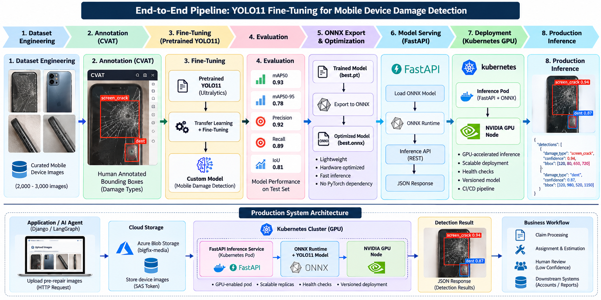

# 🧠 YOLO11 Fine-Tuning for Visual Damage Detection

### 🚀 Pretrained Model → Fine-Tuning → Evaluation → ONNX → FastAPI → Docker → Kubernetes → GPU Inference

### 🤖 End-to-End Computer Vision & Machine Learning Engineering Project

<p align="center">
  
</p>

<p align="center">


</p>

---

# 📖 About This Project

This project demonstrates the complete engineering lifecycle of taking a
**pretrained YOLO11 object detection model** and fine-tuning it for a
specialized visual damage detection problem.

The project focuses primarily on **transfer learning and fine-tuning** rather
than training a computer vision model from random initialization.

The complete workflow covers:

```text
Pretrained YOLO11
        ↓
Dataset Engineering
        ↓
Image Curation
        ↓
Human Annotation
        ↓
YOLO Dataset Preparation
        ↓
Leakage-Safe Dataset Split
        ↓
Transfer Learning
        ↓
YOLO11 Fine-Tuning
        ↓
Model Evaluation
        ↓
Inference Testing
        ↓
ONNX Export
        ↓
ONNX Runtime
        ↓
FastAPI Model Serving
        ↓
Docker
        ↓
Kubernetes
        ↓
GPU-Accelerated Inference
        ↓
Production ML Serving
```

The main objective is to demonstrate practical experience with:

- Transfer Learning
- Fine-Tuning pretrained models
- Computer Vision
- YOLO Object Detection
- Deep Learning
- Dataset Engineering
- Model Evaluation
- Model Optimization
- ONNX
- ONNX Runtime
- FastAPI
- Docker
- Kubernetes
- GPU Inference
- MLOps

---

# 🎯 Project Objective

The objective is to take a pretrained YOLO11 model, adapt it to a
domain-specific visual detection problem through fine-tuning, evaluate its
performance, and build a complete inference system around the resulting model.

The model produces:

```text
Damage Class
      +
Bounding Box
      +
Confidence Score
```

Example:

```json
{
  "image_id": "sample_001",
  "detections": [
    {
      "damage_type": "screen_crack",
      "confidence": 0.94,
      "bbox": [120, 80, 650, 720]
    }
  ]
}
```

The machine learning model focuses on **visual perception and object
detection**.

Application-specific business decisions such as pricing, repair-cost
calculation, and workflow decisions remain outside the computer-vision model.

---

# 🧠 Core Skill — Fine-Tuning

The primary engineering skill demonstrated by this project is:

> **Fine-tuning a pretrained object detection model for a specialized domain.**

The model is not trained from random initialization.

Instead:

```text
                 PRETRAINED YOLO11
                        │
                        ▼
                 Learned Weights
                        │
                        ▼
              Domain-Specific Dataset
                        │
                        ▼
                   Fine-Tuning
                        │
                        ▼
             Specialized YOLO11 Model
```

Fine-tuning adapts the pretrained model's learned parameters to a specialized
visual detection task.

---

# 🔬 Fine-Tuning Workflow

```text
                    YOLO11 PRETRAINED MODEL
                              │
                              ▼
                       Dataset Preparation
                              │
                              ▼
                         CVAT Annotation
                              │
                              ▼
                       YOLO Dataset Format
                              │
                              ▼
                    Train / Validation / Test
                              │
                              ▼
                       YOLO11 Fine-Tuning
                              │
                              ▼
                         Model Evaluation
                              │
                              ▼
                         Trained Weights
                              │
                              ▼
                           ONNX Export
                              │
                              ▼
                         ONNX Runtime
                              │
                              ▼
                            FastAPI
                              │
                              ▼
                        REST Inference API
                              │
                              ▼
                            Docker
                              │
                              ▼
                          Kubernetes
                              │
                              ▼
                       GPU Inference
```

---

# ⚖️ Fine-Tuning vs Training From Scratch

## Training From Scratch

```text
Random Initialization
        ↓
Large Dataset
        ↓
Learn Visual Representations
        ↓
Learn Detection Task
        ↓
Trained Model
```

## Fine-Tuning

```text
Pretrained Weights
        ↓
Domain-Specific Dataset
        ↓
Fine-Tuning
        ↓
Specialized Detection Model
```

Fine-tuning allows an existing pretrained model to be adapted to a specialized
domain without rebuilding the entire model from random initialization.

---

# 🧠 Transfer Learning

Transfer learning means using knowledge learned by a model from a previous
training task as a starting point for a new task.

In this project:

```text
Source
General Pretrained YOLO11
        │
        ▼
Transfer Learning
        │
        ▼
Target
Specialized Visual Damage Detection
```

The pretrained model provides an initial set of learned parameters that are
adapted during fine-tuning.

---

# 👁️ Why Object Detection?

A classification model answers:

```text
Does this image contain damage?
```

A visual inspection system requires more information:

```text
What type of damage?
Where is the damage?
How many damaged regions exist?
How confident is the model?
```

Object detection provides:

```text
Class
  +
Bounding Box
  +
Confidence
```

This makes YOLO suitable for applications where both **classification and
localization** are required.

---

# 🏗️ End-to-End Architecture

```text
                         DATA LAYER
                             │
                             ▼
                         Raw Images
                             │
                             ▼
                        Data Curation
                             │
                             ▼
                        CVAT Annotation
                             │
                             ▼
                         YOLO Dataset
                             │
                             ▼
                    Train / Validation / Test
                             │
                             ▼
                      YOLO11 Fine-Tuning
                             │
                             ▼
                       Model Evaluation
                             │
                             ▼
                            best.pt
                             │
                             ▼
                         ONNX Export
                             │
                             ▼
                           best.onnx
                             │
                             ▼
                        ONNX Runtime
                             │
                             ▼
                           FastAPI
                             │
                             ▼
                       REST Inference API
                             │
                             ▼
                           Docker
                             │
                             ▼
                         Kubernetes
                             │
                             ▼
                       GPU Inference
                             │
                             ▼
                     Production Inference
```

---

# 📊 Dataset Engineering

Model quality starts with dataset quality.

The dataset engineering pipeline follows:

```text
Raw Images
    ↓
Validation
    ↓
Curation
    ↓
Duplicate Checking
    ↓
Quality Review
    ↓
Human Annotation
    ↓
YOLO Conversion
    ↓
Dataset Splitting
    ↓
Training
```

The dataset is treated as a **versioned machine-learning artifact** rather than
simply a collection of images.

---

# 🏷️ Human Annotation

CVAT is used for visual annotation.

The annotation process provides the ground truth required for supervised
object detection training.

```text
Image
  ↓
Human Review
  ↓
Object / Damage Identification
  ↓
Bounding Box
  ↓
Class Assignment
  ↓
Ground Truth
```

Human-reviewed annotations are used as the reference for model training and
evaluation.

---

# 📦 YOLO Dataset Format

YOLO object detection labels contain:

```text
class_id
center_x
center_y
width
height
```

Example:

```text
0 0.512 0.431 0.245 0.318
```

Coordinates are normalized relative to the image dimensions.

---

# 🔐 Data Leakage Prevention

Data leakage can make model evaluation appear better than the model's actual
ability to generalize.

When multiple images represent the same physical object or related sample,
they should not be distributed independently across training, validation, and
test datasets.

### ❌ Incorrect

```text
Sample A → Image 1 → Train
Sample A → Image 2 → Validation
Sample A → Image 3 → Test
```

### ✅ Correct

```text
Sample A → Train

Sample B → Validation

Sample C → Test
```

The objective is:

```text
Train
  ↓
Learn

Validation
  ↓
Develop / Tune

Test
  ↓
Final Evaluation
```

The test set should remain isolated from training and repeated model tuning.

---

# 🏋️ YOLO11 Fine-Tuning

The training lifecycle follows:

```text
Input Image
     ↓
Preprocessing
     ↓
Forward Pass
     ↓
Prediction
     ↓
Loss Calculation
     ↓
Backpropagation
     ↓
Gradient Calculation
     ↓
Optimizer
     ↓
Weight Update
     ↓
Next Training Step
```

Important concepts involved include:

- Parameters
- Weights
- Biases
- Forward Pass
- Loss
- Backpropagation
- Gradients
- Optimizer
- Learning Rate
- Epoch
- Batch
- Training Step
- AdamW
- Mixed Precision
- GPU Acceleration

---

# ⚡ GPU Training

The model is trained using GPU acceleration.

The training environment follows:

```text
NVIDIA GPU
    ↓
CUDA
    ↓
PyTorch
    ↓
Ultralytics YOLO
    ↓
YOLO11 Fine-Tuning
```

GPU acceleration allows deep-learning tensor operations to execute efficiently
on NVIDIA hardware.

---

# 📈 Model Evaluation

The model is evaluated using standard object-detection metrics:

- Precision
- Recall
- IoU
- AP
- mAP50
- mAP50-95

## Precision

Measures how many predicted detections are correct.

```text
Precision =
True Positives
-------------------------
True Positives + False Positives
```

## Recall

Measures how many actual objects are successfully detected.

```text
Recall =
True Positives
-------------------------
True Positives + False Negatives
```

## IoU

Intersection over Union measures overlap between the predicted bounding box
and the ground-truth bounding box.

```text
IoU =
Intersection Area
-----------------
Union Area
```

## mAP50

Mean Average Precision at an IoU threshold of 0.50.

## mAP50-95

Average Precision averaged across IoU thresholds from 0.50 to 0.95.

---

# 📉 Overfitting & Generalization

A model can perform well on training data while performing poorly on unseen
data.

This is called **overfitting**.

```text
Training Performance
        ↑
        ↑
        ↑

Validation Performance
        ↓
```

The objective is not to memorize the training dataset.

The objective is to learn visual patterns that generalize to unseen images.

Therefore:

```text
Training Performance
        ≠
Real-World Performance
```

Proper validation, testing, dataset diversity, and visual prediction inspection
are required before treating a model as production-ready.

---

# 🧪 Inference

Inference means using a trained model to generate predictions on new images.

## Training

```text
Images + Labels
      ↓
Learn Model Parameters
```

## Inference

```text
New Image
    ↓
Trained Model
    ↓
Prediction
```

Inference normally does not update model weights.

---

# 🎯 Confidence Score

A detection contains a confidence score.

Example:

```json
{
  "damage_type": "screen_crack",
  "confidence": 0.94
}
```

Confidence thresholds can be used to filter predictions.

Production thresholds should be selected using validation data and the
consequences of false positives and false negatives rather than choosing an
arbitrary value.

---

# 📦 Model Artifacts

Training produces model checkpoints such as:

```text
best.pt
last.pt
```

The selected model can then be exported for deployment:

```text
best.pt
   ↓
ONNX Export
   ↓
best.onnx
```

Model artifacts should be versioned and associated with the dataset and
training configuration used to produce them.

---

# ⚡ ONNX

ONNX provides a standardized representation of a trained machine-learning
model.

The deployment flow is:

```text
YOLO11 / PyTorch
        ↓
      best.pt
        ↓
    ONNX Export
        ↓
     best.onnx
        ↓
   ONNX Runtime
        ↓
      Inference
```

This creates a separation between:

```text
Training Environment
        │
        ▼
Inference Environment
```

The inference environment does not need to reproduce the complete model
training workflow.

---

# 🚀 FastAPI Model Serving

The fine-tuned model is exposed through a FastAPI inference service.

```text
Client
   │
   │ HTTP Request
   ▼
FastAPI
   │
   ▼
ONNX Runtime
   │
   ▼
Fine-Tuned YOLO11
   │
   ▼
Post Processing
   │
   ▼
JSON Response
```

Example response:

```json
{
  "model_version": "yolo11-damage-v1",
  "detections": [
    {
      "damage_type": "screen_crack",
      "confidence": 0.94,
      "bbox": [120, 80, 650, 720]
    }
  ]
}
```

---

# 📚 OpenAPI & Swagger

FastAPI automatically provides an OpenAPI specification for the inference
service.

This provides interactive API documentation and makes the model-serving
service easier to integrate with other applications.

```text
FastAPI
   ↓
OpenAPI Schema
   ↓
Swagger UI
   ↓
API Testing
```

---

# 🐳 Docker

The inference service is packaged together with its runtime dependencies:

```text
FastAPI
   +
ONNX Runtime
   +
Model
   +
Python Dependencies
        ↓
   Docker Image
```

Docker provides a reproducible runtime environment for model serving.

The same containerized inference service can then be deployed across supported
infrastructure environments.

---

# 🚀 Production Deployment & MLOps

The fine-tuned YOLO11 model is deployed as a **decoupled inference
microservice**, separating computer-vision inference from application and
business logic.

The model is exported from PyTorch to **ONNX**, served through
**FastAPI + ONNX Runtime**, containerized with **Docker**, and deployed as a
GPU-enabled workload on **Kubernetes**.

## Production Architecture

```text
                    PRODUCTION ML ARCHITECTURE

┌─────────────────────────────────────────────────────────────────────┐
│                         APPLICATION LAYER                            │
│                                                                     │
│              Application / AI Agent / Workflow                     │
│                              │                                      │
│                              │ Image + Request                      │
│                              ▼                                      │
│                       ┌───────────────┐                             │
│                       │   FastAPI     │                             │
│                       │ Inference API │                             │
│                       └───────┬───────┘                             │
│                               │                                     │
│                               ▼                                     │
│                    ┌─────────────────────┐                          │
│                    │   Kubernetes GPU    │                          │
│                    │       Workload      │                          │
│                    │                     │                          │
│                    │  ┌───────────────┐  │                          │
│                    │  │ ONNX Runtime  │  │                          │
│                    │  │               │  │                          │
│                    │  │ Fine-Tuned    │  │                          │
│                    │  │ YOLO11 Model  │  │                          │
│                    │  └───────┬───────┘  │                          │
│                    │          │           │                          │
│                    │      NVIDIA GPU      │                          │
│                    └──────────┬───────────┘                          │
│                               │                                     │
│                               ▼                                     │
│                     Detection JSON Result                           │
│                               │                                     │
│                               ▼                                     │
│                   Application / Decision Layer                       │
└─────────────────────────────────────────────────────────────────────┘
```

## Model Deployment Lifecycle

```text
Annotated Dataset
        │
        ▼
YOLO11 Fine-Tuning
        │
        ▼
Model Evaluation
        │
        ▼
     best.pt
        │
        ▼
   ONNX Export
        │
        ▼
    best.onnx
        │
        ▼
Docker Image
        │
        ▼
Container Registry
        │
        ▼
Kubernetes Deployment
        │
        ▼
GPU-enabled Workload
        │
        ▼
FastAPI + ONNX Runtime
        │
        ▼
Production Inference
```

## Production Serving Design

The inference service is intentionally separated from the core application.

```text
Application
     │
     │ REST API
     ▼
FastAPI Inference Service
     │
     ▼
ONNX Runtime
     │
     ▼
YOLO11
     │
     ▼
Damage Detection
```

This separation provides:

- Independent model deployment
- Independent model versioning
- Reproducible inference environments
- GPU-accelerated inference
- Horizontal scaling capability
- Clear separation between AI inference and business logic
- Ability to update the model independently from the core application

## Kubernetes GPU Architecture

The inference workload requests GPU resources from Kubernetes and is scheduled
onto a compatible NVIDIA GPU node.

Example resource declaration:

```yaml
resources:
  limits:
    nvidia.com/gpu: 1
```

This allows the Kubernetes scheduler to place the inference workload on a
GPU-capable node.

## Health & Reliability

The serving layer uses health checks to determine whether the service is
available to receive traffic.

```text
                Kubernetes
                    │
          ┌─────────┴─────────┐
          ▼                   ▼
     Liveness Check      Readiness Check
          │                   │
          └─────────┬─────────┘
                    ▼
             FastAPI Service
                    │
                    ▼
             Model Availability
```

## Inference Contract

The API returns a structured detection response:

```json
{
  "model_version": "yolo11-damage-v1",
  "detections": [
    {
      "damage_type": "screen_crack",
      "confidence": 0.94,
      "bbox": [120, 80, 650, 720]
    }
  ]
}
```

The model is responsible for:

- Damage classification
- Damage localization
- Confidence scoring

Business rules such as pricing, repair-cost calculation, and workflow
decisions remain outside the computer-vision model.

## Deployment Strategy

```text
Code / Model Change
        │
        ▼
CI/CD Pipeline
        │
        ▼
Build Docker Image
        │
        ▼
Push Container Image
        │
        ▼
Deploy Versioned Workload
        │
        ▼
Health Verification
        │
        ▼
Production Inference
```

The model artifact, container image, and deployment configuration are
versioned independently to support controlled releases and rollback.

---

# 🔄 Model Lifecycle

```text
Pretrained YOLO11
        ↓
Fine-Tuning
        ↓
Evaluation
        ↓
Inference Testing
        ↓
Model Version
        ↓
ONNX Export
        ↓
Deployment
        ↓
Monitoring
        ↓
New Data
        ↓
Human Review
        ↓
Next Fine-Tuning Cycle
```

Model improvements should happen through controlled dataset and model versions
rather than uncontrolled automatic retraining.

---

# 🧠 Active Learning

A future model-improvement workflow can use the existing model to assist
annotation.

```text
Unlabelled Images
       ↓
Current Model
       ↓
Predictions
       ↓
Human Review
       ↓
Corrected Annotations
       ↓
Approved Dataset
       ↓
Next Fine-Tuning Cycle
```

Human validation remains part of the process.

The objective is to use production feedback to improve the dataset and
subsequent model versions in a controlled manner.

---

# 🛡️ Production Engineering Principles

The project follows these principles:

- Human-reviewed ground truth
- Leakage-safe dataset splitting
- Isolated test data
- Versioned datasets
- Versioned models
- Reproducible experiments
- Visual prediction inspection
- Validation-based confidence thresholds
- Human review for uncertain predictions
- Controlled retraining
- Separation of model inference and business logic
- Secure handling of private data
- Reproducible deployment environments
- Containerized model serving
- Health-checked inference services
- Versioned deployment artifacts

---

# 🧩 Technology Stack

## Computer Vision

- YOLO11
- Ultralytics
- OpenCV
- Pillow

## Deep Learning

- PyTorch
- CUDA
- NVIDIA GPU
- AMP / Mixed Precision
- AdamW

## Dataset & Annotation

- CVAT
- Python
- YOLO Dataset Format
- CSV
- JSON

## Model Deployment

- ONNX
- ONNX Runtime
- FastAPI
- Pydantic
- OpenAPI
- Swagger

## Engineering

- Python
- Git
- Docker
- REST API

## Cloud / MLOps

- Kubernetes
- NVIDIA GPU Workloads
- Container Registry
- CI/CD
- Model Versioning
- Dataset Versioning
- Monitoring

---

# 📁 Repository Structure

```text
yolo11-fine-tuning-visual-damage-detection/
│
├── README.md
│
├── docs/
│   ├── images/
│   │   └── architecture.png
│   │
│   ├── dataset.md
│   ├── annotation.md
│   ├── fine-tuning.md
│   ├── evaluation.md
│   ├── inference.md
│   └── deployment.md
│
├── src/
│   ├── data/
│   ├── training/
│   ├── inference/
│   └── serving/
│
├── configs/
│   ├── dataset.yaml
│   └── training.yaml
│
├── scripts/
│   ├── prepare_dataset.py
│   ├── train.py
│   ├── evaluate.py
│   └── export_onnx.py
│
├── deployment/
│   ├── Dockerfile
│   └── k8s/
│
├── examples/
│   └── sample_predictions/
│
├── requirements.txt
└── .gitignore
```

---

# 📌 Project Status

```text
[✓] Dataset Engineering
[✓] Image Curation
[✓] Human Annotation Workflow
[✓] YOLO Dataset Preparation
[✓] Leakage-Safe Dataset Splitting
[✓] Transfer Learning
[✓] YOLO11 Fine-Tuning
[✓] GPU Training
[✓] Model Evaluation
[✓] Local Inference
[✓] ONNX Export
[✓] ONNX Runtime
[✓] FastAPI Model Serving
[✓] OpenAPI / Swagger Validation
[✓] Docker Containerization
[✓] Kubernetes Deployment
[✓] GPU-Accelerated Inference
[✓] Production Health Checks
[✓] CI/CD Deployment
[✓] Production Inference
[→] Continuous Model Improvement
```

> The production deployment items should be marked complete only after the
> corresponding deployment and inference paths have been verified.

---

# 🗺️ Roadmap

## Phase 1 — Dataset & Fine-Tuning

- Dataset engineering
- Image curation
- Annotation
- Leakage-safe splitting
- Fine-tuning
- Experiment tracking
- Model evaluation

## Phase 2 — Model Improvement

- Expand dataset
- Improve data diversity
- Improve annotation quality
- Analyze false positives
- Analyze false negatives
- Improve generalization

## Phase 3 — Inference Engineering

- ONNX export
- ONNX optimization
- Inference benchmarking
- FastAPI
- Docker
- API testing

## Phase 4 — Cloud & MLOps

- Container Registry
- Kubernetes deployment
- GPU inference
- CI/CD
- Secure configuration
- Model versioning
- Health checks
- Monitoring

## Phase 5 — Continuous Improvement

- Active learning
- Model-assisted annotation
- Dataset expansion
- Controlled fine-tuning
- Model comparison
- Production model approval

---

# 🏆 Skills Demonstrated

```text
Transfer Learning
Fine-Tuning
YOLO11
Object Detection
Computer Vision
Dataset Engineering
CVAT
Ground Truth
Data Leakage Prevention
Train / Validation / Test Splitting
PyTorch
CUDA
GPU Training
AMP
AdamW
Model Evaluation
Precision / Recall
IoU
mAP
Overfitting
Generalization
Inference
ONNX
ONNX Runtime
FastAPI
Pydantic
OpenAPI
Docker
Kubernetes
GPU Inference
CI/CD
MLOps
Model Versioning
Dataset Versioning
```

---

# 🎯 End-to-End ML Engineering

The primary objective of this project is not simply to train a YOLO model.

It demonstrates the complete engineering journey:

```text
                     PRETRAINED MODEL
                            │
                            ▼
                     TRANSFER LEARNING
                            │
                            ▼
                         FINE-TUNING
                            │
                            ▼
                         EVALUATION
                            │
                            ▼
                          INFERENCE
                            │
                            ▼
                           ONNX
                            │
                            ▼
                      ONNX RUNTIME
                            │
                            ▼
                          FASTAPI
                            │
                            ▼
                           DOCKER
                            │
                            ▼
                        KUBERNETES
                            │
                            ▼
                       GPU INFERENCE
                            │
                            ▼
                    PRODUCTION SERVING
                            │
                            ▼
                        MONITORING
                            │
                            ▼
                   CONTINUOUS IMPROVEMENT
```

---

# 👨‍💻 Engineering Portfolio

This project is part of my personal **AI / ML Engineering Portfolio**.

The primary engineering skill demonstrated is:

> **Taking a pretrained YOLO11 model, fine-tuning it for a specialized object
> detection problem, evaluating the model, exporting it to ONNX, and building
> a containerized inference system around it.**

The project combines:

**Computer Vision + Transfer Learning + Fine-Tuning + Deep Learning +
Model Optimization + API Development + Docker + Kubernetes + GPU Inference +
MLOps**

---

# ⭐ Project Focus

```text
PRETRAINED YOLO11
        ↓
TRANSFER LEARNING
        ↓
FINE-TUNING
        ↓
MODEL EVALUATION
        ↓
ONNX
        ↓
FASTAPI
        ↓
DOCKER
        ↓
KUBERNETES
        ↓
GPU INFERENCE
        ↓
PRODUCTION SERVING
```

> **A production-oriented computer vision engineering project demonstrating
> the complete lifecycle from pretrained model fine-tuning to deployable
> GPU-accelerated inference.**

---

## ⚠️ Portfolio Scope

This repository demonstrates the engineering architecture and methodology
without exposing proprietary business logic, customer information, private
datasets, credentials, production secrets, or company-specific source code.

Private training data and production artifacts are intentionally excluded from
the repository.
